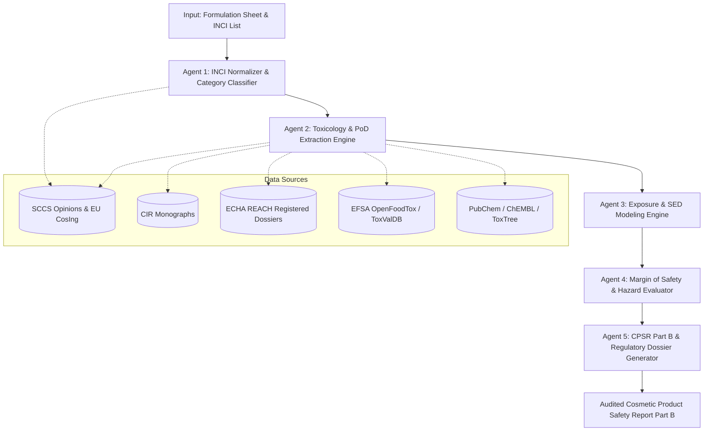
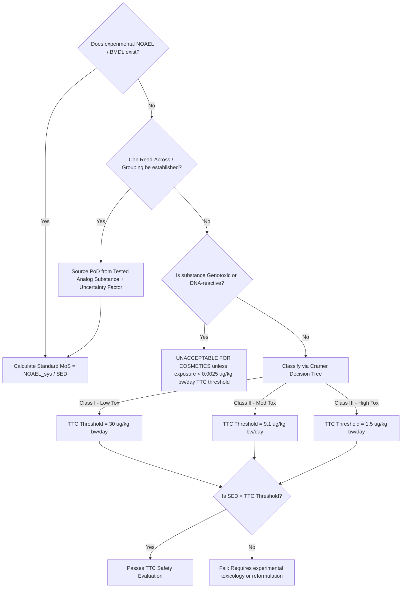

# Cosmetic Ingredient Margin of Safety (MoS) & Exposure Assessment Agent

## 1. Regulatory Context & Framework
This skill defines the autonomous calculation, toxicological point-of-departure (PoD) evaluation, and regulatory risk assessment workflow for cosmetic ingredients based on:
1. **SCCS (Scientific Committee on Consumer Safety)**: *SCCS Notes of Guidance for the Testing of Cosmetic Ingredients and their Safety Evaluation 12th Revision* (SCCS/1647/22).
2. **ECHA (European Chemicals Agency)**: *Guidance on Information Requirements and Chemical Safety Assessment (Chapter R.8: Characterisation of dose [concentration]-response for human health)*.
3. **EFSA (European Food Safety Authority)**: *Guidance on the use of the benchmark dose approach in risk assessment (BMD/BMDL)* and *Threshold of Toxicological Concern (TTC)*.
4. **CIR (Cosmetic Ingredient Review - USA)**: *CIR Procedures & Safety Assessment Monographs*.
5. **ASEAN Cosmetic Directive (ACD)** / **BPOM RI**: *Pedoman Penilaian Keamanan Kosmetika & Kosmetovigilans*.

---

## 2. Mathematical Modeling & Core Formulas

### 2.1. Systemic Exposure Dose ($SED$)
The Systemic Exposure Dose ($SED$) represents the amount of cosmetic ingredient that enters the systemic circulation per kilogram of body weight per day ($\text{mg/kg bw/day}$).

#### Method A: Product Amount-Based (Deterministic Standard Method)
$$SED = \frac{A \times 1000 \times \left(\frac{C}{100}\right) \times \left(\frac{DA_p}{100}\right) \times R}{BW}$$

Where:
- $SED$ = Systemic Exposure Dose ($\text{mg/kg bw/day}$)
- $A$ = Estimated daily amount of cosmetic product applied ($\text{g/day}$)
- $1000$ = Conversion factor from $\text{g}$ to $\text{mg}$
- $C$ = Concentration of the ingredient in the finished product ($\% \text{ w/w}$)
- $DA_p$ = Dermal absorption percentage ($\%$). If in vitro dermal absorption data is not available, default conservative value per SCCS is **$50\%$** (or $100\%$ if Log $K_{ow} < -1$ or $> 4$ with MW $> 500$ Da under specific caution).
- $R$ = Retention factor ($1.0$ for leave-on products; $0.01$ for rinse-off rinse products such as shampoo; $0.1$ for liquid soap/shower gel).
- $BW$ = Default human body weight ($60 \text{ kg}$ for adult per SCCS standard; $5 \text{ kg}$ for infants $0-6$ months; $10 \text{ kg}$ for toddlers $6-12$ months).

#### Method B: Surface Area-Based ($DA_a$ per unit area)
When experimental dermal absorption is determined in $\mu\text{g/cm}^2$ (OECD TG 428 with human/pig skin):
$$SED = \frac{DA_a \times 10^{-3} \times SSA \times F \times R}{BW}$$

Where:
- $DA_a$ = Dermal Absorption per surface area ($\mu\text{g/cm}^2$) [Mean + 1 SD if $\ge 6$ replicates; Mean + 2 SD if $< 6$ replicates].
- $10^{-3}$ = Conversion factor from $\mu\text{g}$ to $\text{mg}$.
- $SSA$ = Skin Surface Area treated ($\text{cm}^2$).
- $F$ = Frequency of application per day ($\text{day}^{-1}$).

---

### 2.2. Point of Departure Adjustment ($PoD_{sys}$ / $NOAEL_{sys}$)
Toxicological studies (e.g., 90-day subchronic oral toxicity OECD TG 408) provide oral Point of Departure ($PoD_{oral}$ / $NOAEL_{oral}$). Since dermal exposure bypasses first-pass gastrointestinal metabolism differently than oral gavage:

$$PoD_{sys} = NOAEL_{sys} = NOAEL_{oral} \times \left(\frac{Abs_{oral}}{100}\right)$$

**SCCS Rules for $Abs_{oral}$ (Oral Bioavailability)**:
- If experimental oral bioavailability is known: Use the exact $\%$.
- If $Abs_{oral} \ge 50\%$: No correction is needed ($NOAEL_{sys} = NOAEL_{oral}$).
- If $Abs_{oral} < 50\%$: Correct $NOAEL_{sys} = NOAEL_{oral} \times \left(\frac{Abs_{oral}}{100}\right)$.
- If no oral absorption data is available: Default to **$50\%$** correction ($NOAEL_{sys} = NOAEL_{oral} \times 0.5$).

---

### 2.3. Margin of Safety ($MoS$) Calculation
$$MoS = \frac{PoD_{sys}}{SED} = \frac{NOAEL_{sys}}{SED} \quad \text{or} \quad \frac{BMDL_{10,sys}}{SED}$$

#### Decision Rule:
- **$MoS \ge 100$**: **SAFE (Acceptable)** for general cosmetic use.
  - Derived from Default Assessment Factor ($AF = 100 = 4 \times 2.5 \times 3.2 \times 3.16$):
    - Interspecies Toxicokinetics: $4.0$
    - Interspecies Toxicodynamics: $2.5$
    - Intraspecies Toxicokinetics: $3.2$
    - Intraspecies Toxicodynamics: $3.16$
- **$MoS < 100$**: **POTENTIALLY UNSAFE / REQUIRES REFORMULATION OR RISK MITIGATION**.

---

### 2.4. Extrapolation & Additional Assessment Factors ($AF_{extra}$)
If standard 90-day oral rodent data is not directly available, ECHA R.8 & SCCS extrapolation factors apply:
1. **Subacute to Subchronic (28-day to 90-day)**: Factor of $3$ ($NOAEL_{adj} = \frac{NOAEL_{28d}}{3}$).
2. **Subchronic to Chronic (90-day to 2-year)**: Factor of $2$.
3. **LOAEL to NOAEL Extrapolation**: Factor of $3$ to $10$ (default $3$ for mild LOAEL, $10$ for severe LOAEL).
4. **Benchmark Dose Lower Limit ($BMDL_{10}$)**: Preferred over NOAEL when dose-response curve data exists (EFSA/SCCS).

---

### 2.5. Aggregate Exposure & Cumulative Risk Assessment
For ingredients present in multiple product categories (e.g., Preservatives like Phenoxyethanol, Parabens) or groups with Common Mode of Action:

#### Total Aggregate SED:
$$SED_{aggregate} = \sum_{i=1}^{n} SED_{product\_i}$$
$$MoS_{aggregate} = \frac{PoD_{sys}}{SED_{aggregate}}$$

#### Hazard Index ($HI$) for Mixture / Cumulative Toxicity:
$$HI = \sum_{i=1}^{k} \frac{SED_i}{DNEL_i} \quad \text{or} \quad \sum_{i=1}^{k} \frac{1}{MoS_i} \times 100$$
- If $HI \le 1.0$: Safe mixture profile.
- If $HI > 1.0$: Hazard concern; cumulative toxicity threshold exceeded.

---

## 3. SCCS Reference Standard Exposure Parameters Table (Adult, 60 kg)

| Product Category | Product Subtype | Daily Amount Applied ($A$, g/day) | Retention Factor ($R$) | Daily Calculated Exposure ($g/day$) | Skin Surface Area ($SSA$, $\text{cm}^2$) | Frequency ($F$, per day) |
| :--- | :--- | :--- | :--- | :--- | :--- | :--- |
| **Skin Care** | Face cream | 1.54 | 1.00 (Leave-on) | 1.54 | 565 | 2.0 |
| | Body lotion | 7.82 | 1.00 (Leave-on) | 7.82 | 15,670 | 1.0 |
| | Hand cream | 2.16 | 1.00 (Leave-on) | 2.16 | 860 | 2.0 |
| | Deodorant (roll-on/stick) | 1.50 | 1.00 (Leave-on) | 1.50 | 200 | 1.0 |
| | Deodorant (spray aerosol) | 1.43 | 1.00 (Leave-on) | 1.43 | 200 | 1.0 |
| **Make-up** | Lipstick / Lip balm | 0.057 | 1.00 (Oral ingestion) | 0.057 | 4.8 | 2.0 |
| | Liquid foundation | 0.51 | 1.00 (Leave-on) | 0.51 | 565 | 1.0 |
| | Eye shadow / Liner | 0.02 | 1.00 (Leave-on) | 0.02 | 24 | 1.0 |
| | Make-up remover | 5.00 | 0.10 (Wiped/Rinsed) | 0.50 | 565 | 1.0 |
| **Hair Care** | Shampoo | 10.46 | 0.01 (Rinse-off) | 0.11 | 1,440 | 1.0 |
| | Hair conditioner | 3.92 | 0.01 (Rinse-off) | 0.04 | 1,440 | 0.28 (2x/wk) |
| | Hair styling (gel/mousse) | 4.00 | 0.10 (Leave-on/part) | 0.40 | 1,440 | 1.0 |
| | Hair styling (spray aerosol)| 5.00 | 0.01 (Hair target) | 0.05 | 1,440 | 1.0 |
| **Hygiene** | Shower gel / Liquid soap | 18.67 | 0.01 (Rinse-off) | 0.19 | 17,500 | 1.0 |
| | Bar soap | 20.00 | 0.01 (Rinse-off) | 0.20 | 17,500 | 1.0 |
| **Oral Care** | Toothpaste (Adult) | 2.75 | 0.05 (Ingested portion)| 0.138 | Oral cavity | 2.0 |
| | Mouthwash | 21.62 | 0.10 (Ingested portion)| 2.16 | Oral cavity | 1.0 |
| **Sun Care** | Sunscreen spray/lotion | 18.00 | 1.00 (Leave-on) | 18.00 | 17,500 | 2.0 |

---

## 4. Multi-Agent AI System Architecture

The AI Cosmetic MoS Safety Assessor is structured as a 5-Stage Orchestrated Multi-Agent Pipeline:



### 4.1. Agent Roles & Specifications

#### Agent 1: INCI & Formulation Normalizer
- **Task**: Standardize cosmetic ingredient names against EU CosIng / INCI dictionaries, CAS/EC numbers, check Annex II (Banned), Annex III (Restricted), Annex IV (Colorants), Annex V (Preservatives), Annex VI (UV Filters).
- **Output**: Validated formula with assigned cosmetic functions, leave-on/rinse-off classification, and active percentage $C (\%)$.

#### Agent 2: Toxicological PoD Harvester
- **Task**: Autonomous retrieval of experimental NOAEL, LOAEL, or $BMDL_{10}$ values from:
  - SCCS Final Opinions
  - CIR Safety Assessment Reports
  - ECHA REACH Registration Dossiers (Subacute/Subchronic/DNT/ReproTox)
  - EFSA Compendia
  - OECD QSAR Toolbox / ToxTree (for Cramer Class TTC if no test data exists).
- **Output**: Structured toxicological endpoints, critical target organs, study duration (28d/90d/chronic), and $Abs_{oral}$ values.

#### Agent 3: Exposure ($SED$) Modeler
- **Task**: Map formula category to SCCS daily consumption values ($A$), application surface area ($SSA$), retention factor ($R$), dermal absorption coefficients ($DA_p$ / $DA_a$), and target population body weights.
- **Output**: Precise $SED$ calculation with full unit-conversion audit trail.

#### Agent 4: Margin of Safety ($MoS$) & Cumulative Risk Assessor
- **Task**: Compute $PoD_{sys}$, calculate $MoS$, apply assessment factors, evaluate cumulative/aggregate exposure across daily multi-product routines, and execute Threshold of Toxicological Concern (TTC) for trace impurities.
- **Output**: Margin of Safety scores, Risk Characterization Ratios (RCR), and Pass/Fail compliance flags.

#### Agent 5: Cosmetic Product Safety Report (CPSR) Synthesizer
- **Task**: Format outputs directly into Regulation (EC) No 1223/2009 Annex I (CPSR Part B: Safety Evaluation by Qualified Safety Assessor) format with specific warnings, batch restrictions, and label claims.

---

## 5. Decision Tree for Missing Data (Non-Testing Strategies)



---

## 6. Input/Output JSON Interface Schemas

### 6.1. Input Schema (Formulation & Exposure Context)
```json
{
  "product_metadata": {
    "product_name": "Hydrating Radiance Facial Cream",
    "product_category": "Face cream",
    "application_type": "leave_on",
    "target_population": "adult",
    "custom_body_weight_kg": 60.0,
    "custom_daily_amount_g": 1.54,
    "retention_factor": 1.0
  },
  "formulation": [
    {
      "inci_name": "Phenoxyethanol",
      "cas_number": "122-99-6",
      "concentration_percent": 0.8,
      "cosmetic_function": "Preservative",
      "toxicology_data": {
        "pod_type": "NOAEL",
        "pod_value_mg_kg_day": 357.0,
        "study_type": "90-day oral gavage (OECD 408)",
        "critical_effect": "Kidney and liver toxicity",
        "source": "SCCS/1575/16",
        "oral_absorption_percent": 100.0,
        "dermal_absorption_percent": 80.0
      }
    },
    {
      "inci_name": "Niacinamide",
      "cas_number": "98-92-0",
      "concentration_percent": 4.0,
      "cosmetic_function": "Skin conditioning",
      "toxicology_data": {
        "pod_type": "NOAEL",
        "pod_value_mg_kg_day": 215.0,
        "study_type": "90-day oral rat",
        "source": "CIR 2005",
        "oral_absorption_percent": 100.0,
        "dermal_absorption_percent": 50.0
      }
    }
  ]
}
```

### 6.2. Output Schema (Risk Evaluation Dossier)
```json
{
  "evaluation_summary": {
    "product_name": "Hydrating Radiance Facial Cream",
    "overall_safety_conclusion": "SAFE_FOR_INTENDED_USE",
    "standard_compliance": ["SCCS/1647/22", "EC_1223/2009", "CIR"],
    "date_of_assessment": "2026-09-25",
    "assessor_qualification": "Cosmetic Safety Assessor (Part B)"
  },
  "ingredient_assessments": [
    {
      "inci_name": "Phenoxyethanol",
      "cas_number": "122-99-6",
      "concentration_percent": 0.8,
      "regulatory_status": "Annex V / Item 29 (Max limit 1.0%) -> COMPLIANT",
      "calculations": {
        "daily_product_applied_mg": 1540.0,
        "dermal_absorption_percent_used": 80.0,
        "sed_mg_kg_day": 0.1643,
        "noael_oral_mg_kg_day": 357.0,
        "oral_absorption_percent": 100.0,
        "noael_systemic_mg_kg_day": 357.0,
        "mos_calculated": 2172.85,
        "minimum_required_mos": 100.0
      },
      "risk_characterization": {
        "safety_margin_status": "ACCEPTABLE",
        "toxicological_notes": "MoS (2172) exceeds safety threshold of 100 by >20x. Well within safe envelope."
      }
    }
  ],
  "aggregate_exposure_notes": {
    "phenoxyethanol_aggregate_warning": "Consider cumulative exposure if used simultaneously with body lotion and wipes."
  }
}
```

---

## 7. Execution Checklist for the AI Agent
When requested to analyze a cosmetic formula:
1. **Check Regulatory Restrictions**: Match INCI with EU CosIng Annexes II, III, IV, V, VI.
2. **Determine SED Parameters**: Pull $A$, $R$, $BW$ from SCCS standard table based on product category.
3. **Verify Dermal Penetration**: Use experimental $DA_p$ ($DA_a$) if provided; otherwise assign conservative 50% default.
4. **Determine $NOAEL_{sys}$**: Factor in $Abs_{oral}$ adjustment per SCCS guidelines.
5. **Compute MoS**: Execute $PoD_{sys} / SED$.
6. **Evaluate Vulnerable Groups**: Trigger baby/infant warnings (0-3 years) or compromised skin barrier adjustments where applicable.
7. **Draft CPSR Part B Statement**: Formulate concluding regulatory opinion with complete mathematical audit trail.
